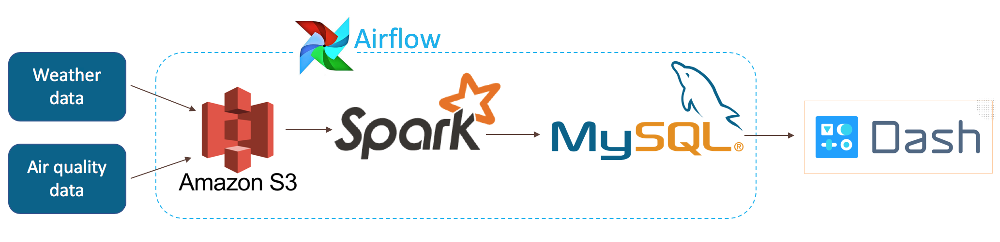

# Air Quality Monitor
The goal of my Insight Data Engineering project was to develop a data pipeline and Web platform for monitoring air quality globally combined with climate data such as temperature and wind. My data application will provide a relational database that data scientists and analysts can easily query and retrieve the air quality and climate data joined together for each location and time, to perform analytics and modeling.

## Table of contents
## Motivation
Air quality is very important for human health and the environment. Air pollution can cause both short term and long term effects on health, e.g. respiratory diseases. Therefore, it is worthwhile to actively monitor and update the air quality parameters. Air quality is related with climate data, and it can be very interesting for data scientist and environmental scientist to study this relationship.

The statistical results of each air quality parameter for a week, a month, the same time of everyday, the same month every year will be compute. The changing rates of the air quality parameters will also be tracked. It could be used for monitoring local air quality and providing warnings when air quality is unacceptable.

The broader goal of this project is to build a platform combining air quality data and weather data for data analytics teams to help develop new predictive models of air quality.

## Data pipeline

1. Download datasets on EC2 instance and then transfer to S3 bucket
2. Data transformation and analytics by spark
3. Cleaned data and analytics results are loaded into a MySQL database launched on RDS.
4. Crucial analytics results will be displayed on a webpage using Flask.

## AWS set-up
1. Set up Pegasus and spin up a cluster as described by https://docs.google.com/document/d/1InLxbu-FH2nyd0NuJ3ewdvAt0Ttk_bNUwlQop38lq0Q/edit
2. Install packages
peg install spark-cluster ssh
peg install spark-cluster aws
peg install spark-cluster environment

peg install spark-cluster hadoop
peg service spark-cluster hadoop start

peg install spark-cluster spark
peg service spark-cluster spark start

peg install spark-cluster zookeeper
peg service spark-cluster zookeeper start

peg install spark-cluster kafka
peg service spark-cluster kafka start

3. Create an S3 bucket
    s3://sy-insight-aq-climate-data
4. Launch RDS with MySQL
    follow the instruction https://docs.aws.amazon.com/AmazonRDS/latest/UserGuide/CHAP_GettingStarted.CreatingConnecting.MySQL.html

5. Create an EC2 instance with 300 GB for Download and transfer data.
